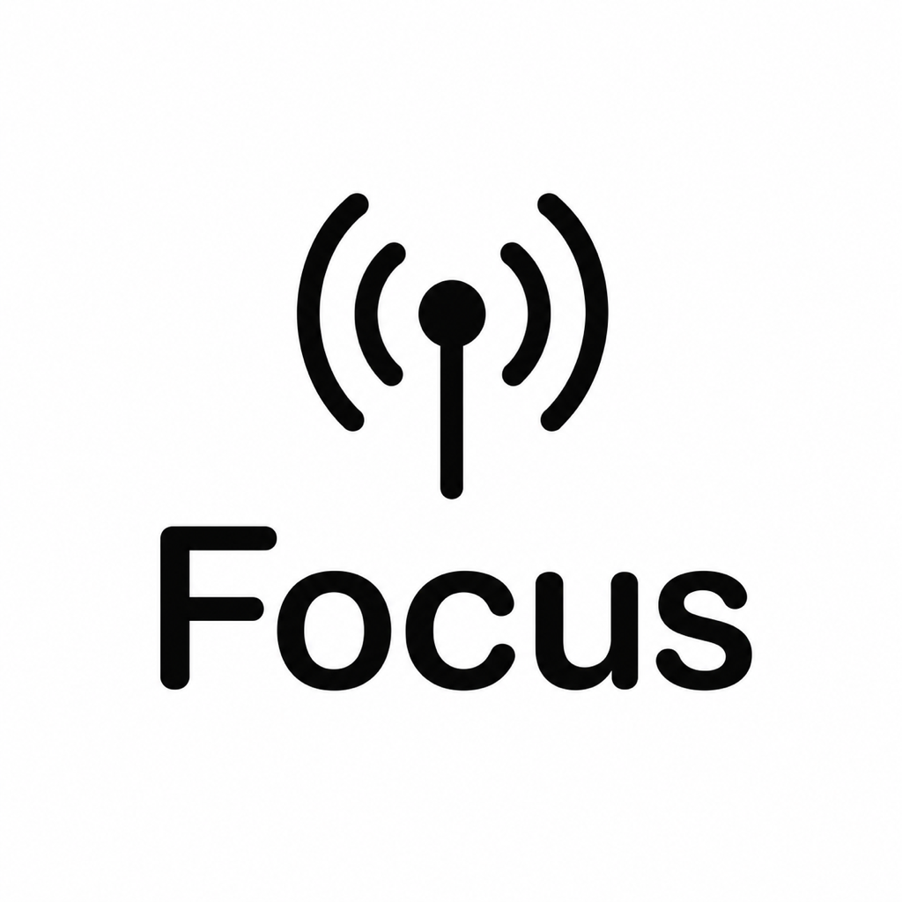

<div align="center">
  
  <h1 align="center">Focus</h1>
  <p align="center">Умный iOS органайзер с AI-ассистентом</p>

  <p>
    
    
    
    
    
  </p>
</div>

---

## Возможности

| | Feature | Описание |
|---|---------|----------|
| ✅ | **Задачи** | Синхронизация с напоминаниями iOS (EventKit), фильтр по спискам, плавная анимация завершения |
| ✅ | **Заметки** | SwiftData, AI-саммари, категории, изображения |
| ✅ | **Календарь** | События из календаря, создание событий |
| ✅ | **FocusAI** | Чат с AI на OpenRouter. Режим **Focus** — AI знает ваши задачи, заметки и события. Режим **Simple** — обычный чат |
| ✅ | **Тёмная тема** | Адаптивные цвета, системный светлый/тёмный режим |
| ✅ | **Виджеты** | 3 виджета: задачи (с анимацией), календарь, статистика |
| ✅ | **Focus Sessions** | Таймер для фокусировки на задачах |
| ✅ | **Siri Shortcuts** | «Быстрая задача» через Shortcuts / экран блокировки |
| ✅ | **Music** | Управление музыкой |

## Установка

1. Клонировать репозиторий
2. Открыть `todoapp.xcodeproj` в Xcode 16+
3. Выбрать свой iPhone как target (не симулятор)
4. Настроить API ключ в `Config/Secrets.swift`:

```swift
struct Secrets {
    static let openCodeKey = "sk-or-v1-..."
}
```

5. Собрать и запустить (Cmd+R)

> **Важно**: для работы AI требуется ключ от [OpenRouter](https://openrouter.ai). Бесплатные модели доступны через `openrouter/free`.

## Сборка Release

1. `Product` → `Scheme` → `Edit Scheme` → `Run` → `Build Configuration: Release`
2. Выбрать iPhone как destination
3. Cmd+R

Без подписки Apple Developer приложение работает 7 дней, затем нужно перезапустить через Xcode.

## Используемые технологии

- **Swift 6**, SwiftUI, SwiftData
- **EventKit** — напоминания и календарь
- **OpenRouter API** — AI чат
- **WidgetKit** — виджеты
- **AppIntents** — Siri Shortcuts
- **Architecture**: MV, @Observable, SwiftData @Query

## Лицензия

MIT
